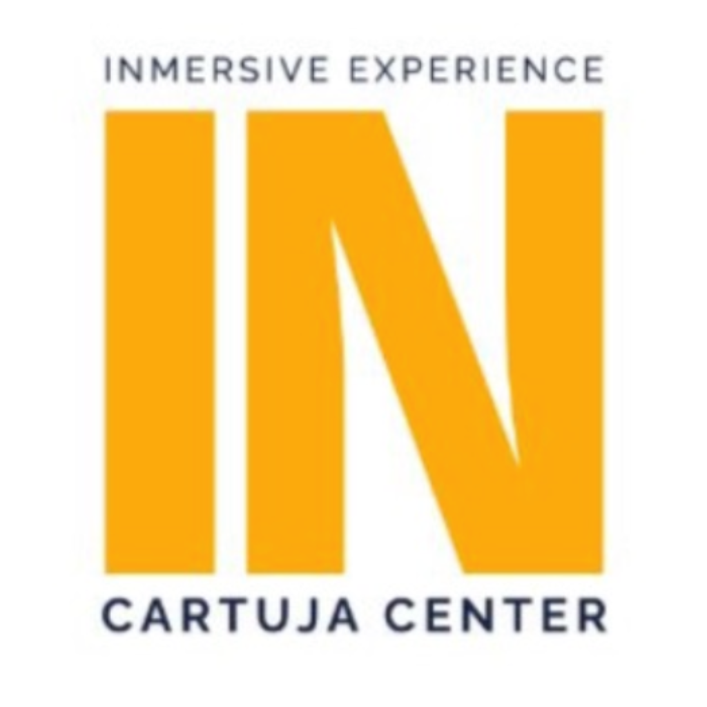
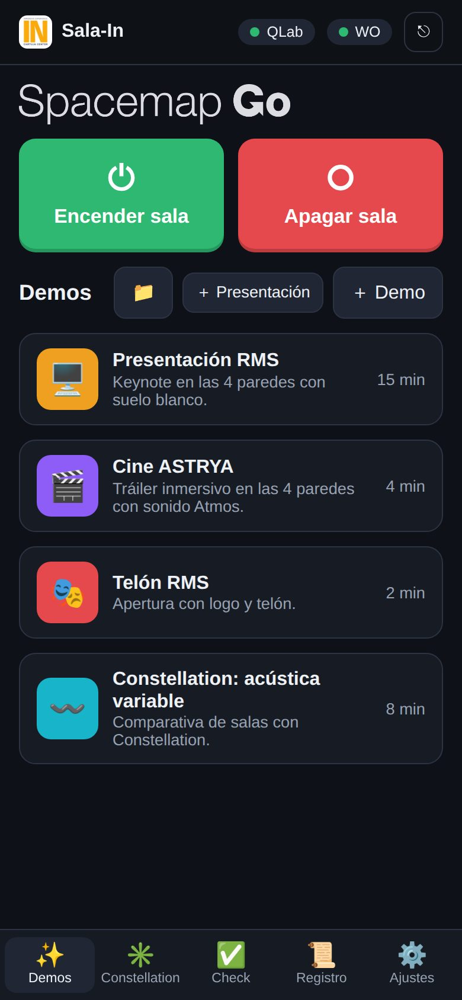
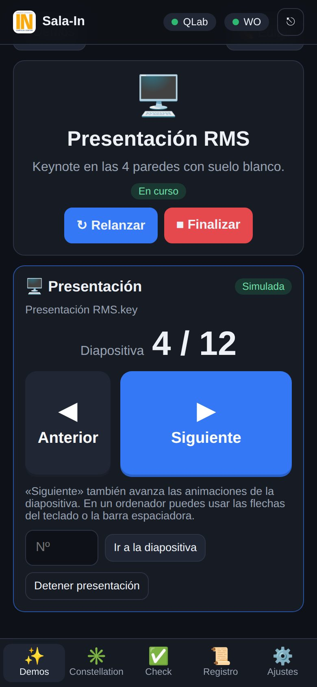
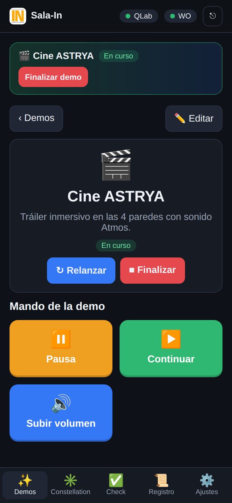
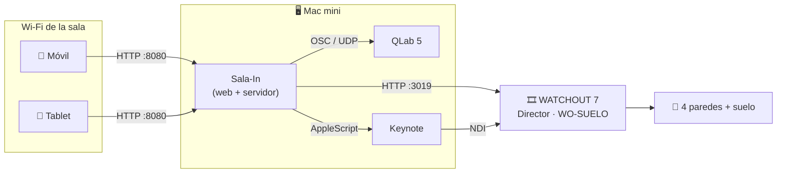
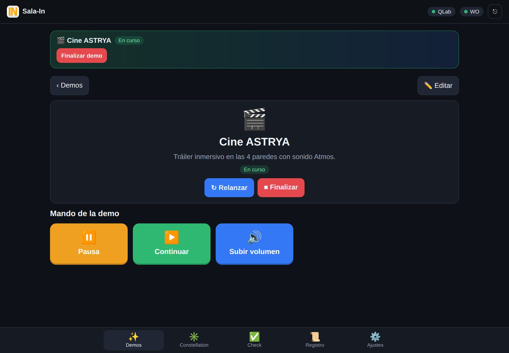

<p align="center">
  
</p>

<h1 align="center">Sala-In</h1>

<p align="center">
  <strong>La sala inmersiva, desde el móvil.</strong><br>
  Lanza demos, presenta Keynote en las cuatro paredes y controla QLab y WATCHOUT<br>
  sin tocar el ordenador de show: basta con estar en la Wi‑Fi de la sala.
</p>

<p align="center">
  
  
  
  
  
</p>

<p align="center">
  
  &nbsp;
  
  &nbsp;
  
</p>

---

## Qué es

Sala-In es un servidor pequeño que vive en el Mac mini de la sala. Mantiene **una sola conexión** con QLab
y con WATCHOUT en nombre de todos, y publica una web que cualquier persona con usuario abre desde su móvil
o tablet. Nadie tiene que configurar IPs, passcodes ni workspaces: entra, elige la demo y la lanza.



## Qué puede hacer

| | |
|---|---|
| ✨ **Demos** | Un botón lanza la demo completa: configura la sala con cuenta atrás, ejecuta la preparación y el lanzamiento, y activa su mando. Solo hay una demo en curso: si lanzas otra, **la anterior se finaliza sola**. |
| 🖥️ **Presentaciones** | Sube un Keynote o PowerPoint desde el móvil y preséntalo en las cuatro paredes, con animaciones. Mando de diapositivas en el móvil y con las flechas del teclado. |
| 🎞️ **WATCHOUT 7** | Reproduce, pausa o para cualquier timeline. La web lee la lista de timelines para elegirlos por nombre. |
| 🎚️ **QLab 5** | Cualquier comando OSC, con argumentos (`/cue/1/sliderLevel 0 -10`). |
| ✏️ **Editor** | Crea y edita demos en el navegador: comandos, esperas, confirmaciones e instrucciones para el operador, y botones de mando con icono y color. |
| ✳️ **Constellation, Check y ON/OFF** | Los mismos controles que la app de iPad: presets de Constellation, check de altavoces, reset AVB y encendido de sala. |
| 👥 **Usuarios** | Tres roles: *operador* (lanza), *editor* (crea demos y sube archivos) y *admin* (ajustes y usuarios). |
| 📡 **Tiempo real** | Todos los móviles ven lo mismo al instante: qué demo está en curso, la cuenta atrás, la diapositiva actual. Todo queda en el registro con el nombre de quien lo hizo. |

<p align="center">
  
</p>

## Empezar

**Probarla en cualquier ordenador**, con QLab y WATCHOUT simulados y demos de ejemplo:

```sh
cd web
npm run demo          # → http://localhost:8080 · admin / demo1234
```

**Instalarla en el Mac mini de la sala**: guía paso a paso en **[web/README.md](web/README.md)**.

## Estructura del repositorio

```
Sala-In/
├── web/                  Sala-In: servidor Node.js y web (la parte principal)
│   ├── src/              servidor: QLab, WATCHOUT, Keynote, demos, usuarios
│   ├── public/           la web que se abre en el móvil
│   ├── tools/            modo demostración y simuladores de QLab y WATCHOUT
│   ├── test/             pruebas automáticas (npm test)
│   └── deploy/           arranque automático en el Mac
├── QLabRemoteCues/       app nativa para iPad e iPhone (SwiftUI)
├── Tools/                simulador de QLab en Swift
└── docs/                 capturas y documentación de la app
```

## Documentación

- 📘 **[Guía de la web](web/README.md)**: instalación, configuración, presentaciones, solución de problemas.
- 📱 **[App para iPad e iPhone](docs/app-ios.md)**: la app nativa QLab Remote Cues, que comparte el formato de
  configuración con la web.

<p align="center"><sub>RMS Pro Audio · Sala inmersiva</sub></p>
